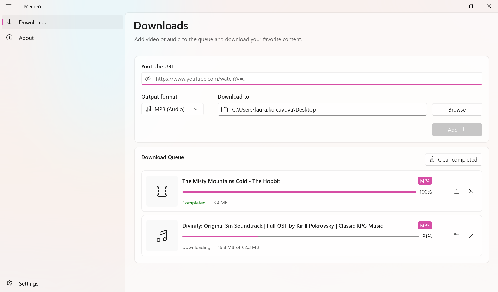

# MermaYT

A Windows GUI wrapper for the [yt-dlp](https://github.com/yt-dlp/yt-dlp) command-line tool.

## About

MermaYT provides a simple graphical interface for downloading audio and video from YouTube via yt-dlp.

## Screenshots


## Features

- Download YouTube videos and audio
- Supports MP3 and MP4
- Light, dark, and system theme support
- When downloading audio, ffmpeg is used to convert downloaded video to MP3

## Requirements

- Windows 10 or later

## Tech Stack

- **UI:** WinUI 3
- **Framework:** .NET 8

## Build

### Publish portable release (x64)

```powershell
dotnet publish src/MermaYT.WinUi/MermaYT.WinUi.csproj -c Release -r win-x64 --self-contained /p:Platform=x64 /p:WindowsPackageType=None /p:WindowsAppSDKSelfContained=true /p:PublishSingleFile=true
```
